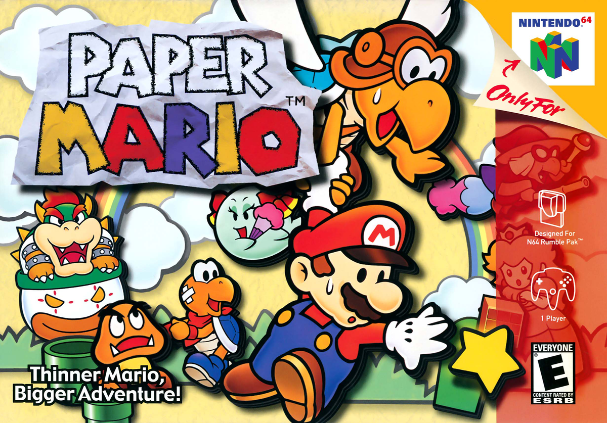

# Paper Mario

Paper Mario

| **Attribute** | **Details** |
|---------------|-------------|
| **Developer** | Intelligent Systems |
| **Publisher** | Nintendo |
| **Platform(s)** | Nintendo 64, iQue Player, Virtual Console (Wii, Wii U), Nintendo 64 - Nintendo Switch Online |
| **Release date** | **Nintendo 64:**  - August 11, 2000  - February 5, 2001  - October 5, 2001  - October 5, 2001  - June 8, 2004 (iQue Player)  **Virtual Console (Wii):**  - July 10, 2007  - July 13, 2007  - July 13, 2007  - July 16, 2007  **Virtual Console (Wii U):**  - April 30, 2015  - May 21, 2015[1]  - May 22, 2015  - July 15, 2015  **Nintendo 64 - Nintendo Switch Online:**  - December 10, 2021[2]  - December 10, 2021[3]  - December 10, 2021[4]  - December 10, 2021  - December 10, 2021  - December 10, 2021

## Introduction

Mario pals around in an all-new action adventure! Mario's back in his first adventure since Super Mario 64, and this time, Bowser's bent on preventing a storybook ending. When Princess Peach is kidnapped, Mario plots to rescue the seven Star Spirits and rid the Mushroom Kingdom of Koopa's cruel cohorts. As he travels from the tropical jungles of Lavalava Island to the frosty heights of Shiver Mountain, he'll meet up with seven all-new companions... and he'll need help from each one or there'll be no happily ever after.

