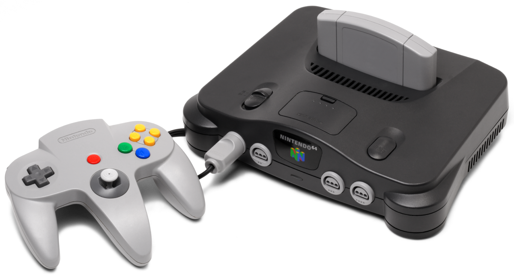

# Nintendo 64

## Infomation
The table below provides detailed information about the Nintendo 64, including its generation, release dates in various regions, discontinuation dates, and its predecessor and successor consoles.

| Generation | Fifth generation |
|------------|------------------|
| Release Date | Japan - June 23, 1996 |
|  | North America - September 29, 1996 |
|  | Europe - March 1, 1997 |
|  | Australia - March 1, 1997 |
|  | France - September 1, 1997 |
|  | Brazil - December 10, 1997 |
|  | China (iQue Player) - November 17, 2003 |
| Discontinued | Japan - April 30, 2002 |
|  | North America - May 11, 2003 |
|  | Europe - May 16, 2003 |
|  | Australia - November 30, 2003 |
|  | China (iQue Player) - December 31, 2016 |
| Predecessor | Super Nintendo Entertainment System |
| Successor | Nintendo GameCube |

---

## Introduction and Backstory
The Nintendo 64 (formatted on the logo as NINTENDO®64), also referred to as the N64, as well as rebranded as the Hyundai Comboy 64 in South Korea, is a video game console created by Nintendo. It was released in 1996 to compete with the Sega Saturn and the PlayStation. It was codenamed "Project Reality" during development and is the first Nintendo home console to use the same name and design between the Japanese and international versions.

After failing to beat the PlayStation and the Super Nintendo Entertainment System's sales, the Nintendo 64 was described as "a step backwards for the company in terms of commercial success"[4] due to a number of poor business decisions associated with the system, most notably the choice to use ROM cartridges for its games (instead of the higher-capacity CD-ROMs used by competing systems) and a lack of substantial third-party support, the latter of which is commonly pinned on frustrations with Nintendo's licensing policies. Despite this, the Nintendo 64 gained popularity during the first few months of its release, mainly due to the release of the critically acclaimed Super Mario 64. Furthermore, although its sales figures were lackluster, the Nintendo 64 is not considered a true commercial failure, still generating a profit for Nintendo and outselling the Sega Saturn outside Japan.

Super Mario 64 was one of the first games of its kind to feature full 3D graphics and depth of field effects. The Nintendo 64 was able to pull this off because it was the first system to feature a 64-bit processor and 32-bit graphics chip (aside from the failed Atari Jaguar, which featured multiple coprocessors using 64-bit architecture on a 32-bit main processor). The Nintendo 64 also featured the first successful analog control stick implementation and four built-in controller ports, unlike its competitors, the PlayStation and the Sega Saturn. The console is also Nintendo's first with 16:9 widescreen support (in addition to the traditional 4:3), though only 13 titles supported this feature, with Donkey Kong 64 being the sole game related to the Super Mario franchise among them. Conversely, the Nintendo 64 is noted as the last home console system to use cartridges until the Nintendo Switch. Starting with the Nintendo GameCube and carrying on until the Wii U, Nintendo would shift to using optical disks like its competitors, albeit with proprietary formats instead of industry standard ones.

The Nintendo 64 is best known for games such as Super Mario 64, Super Smash Bros., Mario Kart 64, Mario Party, Paper Mario, Donkey Kong 64, Star Fox 64, The Legend of Zelda: Ocarina of Time, GoldenEye 007, Banjo-Kazooie, and F-Zero X. Production of the Nintendo 64 ended in 2002. The Nintendo 64 sold 32.93 million units during its lifetime.[5]

In 1999, Nintendo released the Nintendo 64DD; similarly to the Family Computer Disk System, it was an add-on that enabled support for games on proprietary magnetic disks. The add-on was intended as a cheaper alternative to optical disc-based competitors, but it ultimately became a commercial failure due to its belated and limited release. In total, four games of the Super Mario franchise were released on the 64DD, all in the Mario Artist series.

In 2003, the iQue Player was released in China, serving as the Chinese equivalent of the Nintendo 64, albeit with a differently designed controller. Its D-Pad and analog stick are placed as on the Nintendo GameCube Controller. The entire system consists of only the controller, which has the chip onboard. It has a limited selection of Super Mario titles, all of which were released for the Nintendo 64 outside China. These include Super Mario 64, Mario Kart 64, Paper Mario, Yoshi's Story, Dr. Mario 64, and Super Smash Bros.

The above text is from the Super Mario Wiki and is available under a Creative Commons license. Attribution must be provided through a list of authors or a link back to the original article. Source: https://www.mariowiki.com/Nintendo_64
